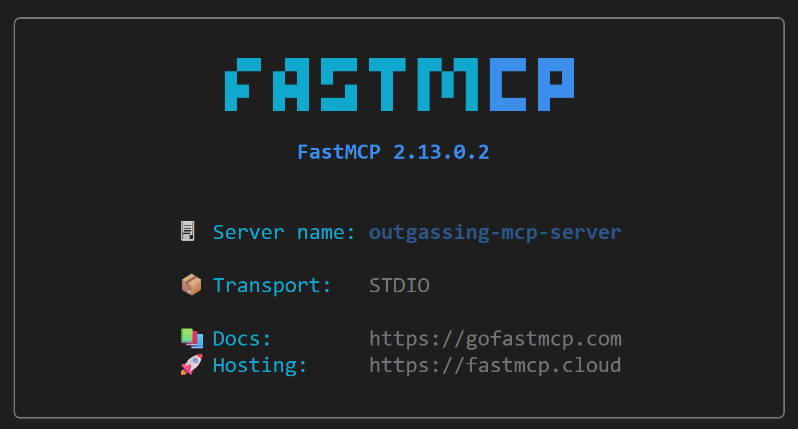

# Outgassing MCP Server

[](https://opensource.org/licenses/Apache-2.0)
[](https://www.python.org/downloads/)
[](https://gofastmcp.com)
[](https://www.docker.com/)

A Model Context Protocol (MCP) server that provides access to NASA's outgassing database for aerospace material selection. This server enables querying of material outgassing properties (TML, CVCM, WVR) by compatible large language models.

## Overview

This MCP server is built with [FastMCP](https://gofastmcp.com) and containerized with Docker. It provides three tools for querying 13,582 aerospace materials from NASA's outgassing database, with intelligent fuzzy search and automatic compliance checking against NASA-STD-6016 standards.

## Features

- **Fuzzy Material Search**: Find materials by name using intelligent matching (rapidfuzz)
- **Application-Based Search**: Filter materials by usage type (ADHESIVE, POTTING, TAPE, etc.)
- **Compliance Checking**: Automatic TML/CVCM validation with WVR adjustment
- **VS Code Integration**: Seamless access through GitHub Copilot Chat
- **Corporate Network Support**: Built-in Zscaler certificate handling

## Available Tools

### 1. `search_materials`
Search for materials by name with fuzzy matching and compliance validation.

**Parameters:**
- `material` (string): Material name to search for
- `max_tml` (float, optional): Maximum acceptable TML % (default: 1.0)
- `max_cvcm` (float, optional): Maximum acceptable CVCM % (default: 0.1)

**Returns:** Up to 100 matched materials with outgassing data and compliance flags

**Example usage in Copilot Chat:**
```
Check the outgassing-mcp-server for RTV adhesives with TML under 0.5%.
```

### 2. `get_applications`
Retrieve all unique application/usage types from the database.

**Parameters:** None

**Returns:** List of all available application categories (961 unique types)

**Example usage in Copilot Chat:**
```
Check the outgassing-mcp-server to see what material application types are listed?
```

### 3. `search_by_application`
Search materials by application type, returning only compliant materials.

**Parameters:**
- `application` (string): Application type (e.g., "ADHESIVE", "POTTING")
- `max_tml` (float, optional): Maximum acceptable TML % (default: 1.0)
- `max_cvcm` (float, optional): Maximum acceptable CVCM % (default: 0.1)

**Returns:** Only materials meeting both TML and CVCM limits for the specified application

**Example usage in Copilot Chat:**
```
Check the outgassing-mcp-server to find compliant adhesives for spacecraft use.
```

## Understanding Outgassing Data

- **TML (Total Mass Loss)**: Percentage of material mass lost in vacuum
- **CVCM (Collected Volatile Condensable Material)**: Percentage that condenses on a collector
- **WVR (Water Vapor Recovery)**: Mass of water vapour regained by specimen following outgassing
- **NASA-STD-6016**: [MPR 95] Requires TML ≤ 1.0% and CVCM ≤ 0.1% (after WVR adjustment) 
- **Adjusted TML**: TML - WVR Used when absorbed water lost does not affect functionality
- **Special Cases**: Contamination sensitive surfaces such as optical lenses may require a lower CVCM than the above 

## Prerequisites

- **Docker**: Ensure Docker is installed and running on your system
- **VS Code**: Latest version with GitHub Copilot extension enabled
- **Network Access**: Internet connectivity for downloading dependencies (corporate networks may require additional certificate setup)

## Installation & Setup

### 1. Clone the repository locally

Navigate to the location you wish to store the repository and clone it:

```bash
git clone https://github.com/aerospace-mcp-tools/outgassing-mcp-server.git
```

### 1. Certificate Setup (Corporate Networks Only)

If you're behind a corporate firewall using Zscaler or similar proxy:

1. Obtain your organization's root certificate
2. Copy the certificate file to the repository root
3. Rename it to `zscaler-root-ca.crt`

See [SECURITY.md](SECURITY.md) for using Docker with Zscaler

### 2. Build the Docker Image

Navigate to the repository directory and build the Docker image:

```bash
docker build -t outgassing-mcp-server .
```

This command:
- Downloads Python 3.14 base image
- Installs required dependencies using UV package manager
- Configures Docker for Zscaler
- Sets up the FastMCP server environment

### 3. Verify Installation

Test that the server builds and runs correctly:

```bash
docker run -it --name test outgassing-mcp-server
```

You should see the FastMCP startup banner:



Stop the test container and clean up:
```bash
docker stop test
docker rm test
```

## VS Code Integration

This MCP server works with any MCP-compatible client that supports stdio transport. Each client will have its own configuration file location and JSON structure, but all use the same Docker container and command. The example given below shows integration with Github Copilot on VS Code.

### Method 1: Using VS Code Command Palette (Recommended)

1. Open VS Code and press `Ctrl+Shift+P` (Windows/Linux) or `Cmd+Shift+P` (macOS)
2. Type and select **"MCP: Add Server"**
3. Choose **"Command (stdio)"** as the transport type
4. Enter the Docker command:
   ```
   docker run --rm -i --network host outgassing-mcp-server
   ```
5. Name the server: `outgassing-mcp-server`
6. The server will be automatically added to your MCP configuration

### Method 2: Manual Configuration

Alternatively, you can manually edit your MCP configuration file:

**Location**: `%APPDATA%\Code\User\mcp.json` (Windows) or `~/.config/Code/User/mcp.json` (Linux/macOS)

Add the following configuration:

```json
{
  "servers": {
    "outgassing-mcp-server": {
      "type": "stdio",
      "command": "docker",
      "args": [
        "run",
        "--rm",
        "-i",
        "--network",
        "host",
        "outgassing-mcp-server"
      ]
    }
  }
}
```

### Verification

1. Restart VS Code after configuration
2. Open GitHub Copilot Chat
3. Test the mcp server with an example from above!

## Data Source

- **Database**: NASA Outgassing Database (12,859 materials)
- **Online Source**: https://catalog.data.gov/dataset/outgassing-db
- **Local Cache**: `Outgassing_Db_rows.csv` (automatic fallback)
- **Standards**: NASA-STD-6016 (Standard Materials and Process Requirements for Spacecraft)
- **Notes**: More information on the NASA outgassing database is given here: https://etd.gsfc.nasa.gov/capabilities/outgassing-database/

## Configuration Details

### Docker Run Parameters Explained

- `--rm`: Automatically remove container when it exits (prevents container buildup)
- `-i`: Keep STDIN open for interactive communication with MCP protocol
- `--network host`: Use host networking for seamless VS Code stdio communication
- `outgassing-mcp-server`: The Docker image name built in earlier steps

## Development & Contributing

Interested in contributing to this project? Please see [CONTRIBUTING.md](CONTRIBUTING.md) for:
- Development setup instructions
- Testing procedures
- Code guidelines
- How to submit changes

### Project Structure
```
outgassing-mcp-server/
├── main.py                       # FastMCP server 
├── Dockerfile                    # Multi-stage build with cert support
├── pyproject.toml                # Dependencies (fastmcp, pandas, rapidfuzz)
├── data/
|   └── Outgassing_Db_rows.csv    # Local data cache (12,859 materials)
├── README.md                     # This file
├── CONTRIBUTING.md               # Contribution guidelines
├── SECURITY.md                   # Security policy and considerations
└── .github/
    └── copilot-instructions.md  # Development guidelines for LLMs
```

## Troubleshooting

### Container Issues

**Stale data issues:**
- Outgassing data is only downloaded when container is built
- Re-build container to get latest data

**Container fails to start:**
- Verify Docker is running: `docker --version`
- Check image exists: `docker images | grep outgassing-mcp-server`
- Review build logs for errors during image creation
- Test manually: `docker run -it --name test outgassing-mcp-server`

### VS Code Integration Issues

**VS Code doesn't detect the server:**
- Confirm `mcp.json` configuration syntax is valid JSON
- Verify file location: `%APPDATA%\Code\User\mcp.json` (Windows)
- Restart VS Code after configuration changes
- Check VS Code Developer Console (`Help > Toggle Developer Tools`) for MCP-related errors
- Ensure Docker Desktop is running before starting VS Code

**Server appears but tools don't work:**
- Rebuild the Docker image to ensure latest code
- Check that FastMCP banner shows on startup
- Test tools manually: `docker run -it --name test outgassing-mcp-server`

## Technical Details

### Dependencies
- **Python**: 3.14 (slim-trixie base image)
- **FastMCP**: ≥2.13.0.2 (MCP protocol implementation)
- **pandas**: ≥2.3.3 (data processing)
- **rapidfuzz**: ≥3.14.3 (fuzzy string matching)

### Security Considerations

For detailed security information, including vulnerability reporting, and privacy considerations, please see [SECURITY.md](SECURITY.md).

**Key points:**
- No authentication required (local VS Code integration)
- Container runs with default user (non-root when possible)

## Support & Resources

- **FastMCP Documentation**: https://gofastmcp.com
- **MCP Protocol Specification**: https://modelcontextprotocol.io
- **Docker Documentation**: https://docs.docker.com
- **NASA Outgassing Database**: https://etd.gsfc.nasa.gov/capabilities/outgassing-database/
- **NASA-STD-6016**: Standard Materials and Processes Requirements for Spacecraft

## Project Documentation

- [CONTRIBUTING.md](CONTRIBUTING.md) - How to contribute to this project
- [SECURITY.md](SECURITY.md) - Security policy and vulnerability reporting
- [LICENSE](LICENSE) - Apache 2.0 License details
- [CODE_OF_CONDUCT.md](CODE_OF_CONDUCT.md) - Community guidelines

## Acknowledgments

- **Data Source**: NASA Outgassing Database
- **Framework**: FastMCP by the FastMCP team
- **Protocol**: Model Context Protocol (MCP) specification
